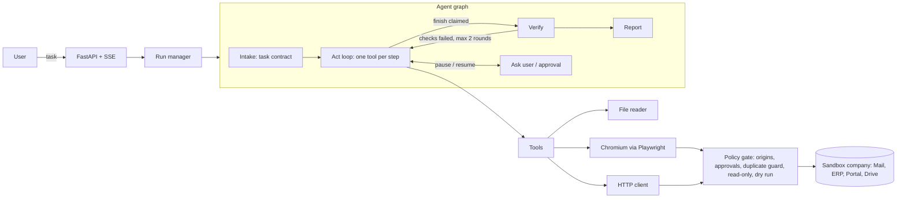

# Autonomous AI Task Worker

You give it a task in plain English, like *"Find the latest invoice from Globex, pull out the amount and due date, enter it into our ERP and tell me when it's done"*. It opens a real browser, finds the email, downloads and reads the PDF, signs into the ERP, fills the form, checks that the record really exists, and comes back with a short report and evidence.

It works against **Acme Corp**, a small fake company I built for this: a mailbox, an ERP with a UI and a REST API, a supplier portal behind a login, and a shared drive with policy documents. Everything is real HTTP, real HTML, real PDFs and a real Chromium. Nothing in the agent is mocked.

The agent code knows nothing about Acme, invoices or ERPs. A test enforces that (`tests/test_generalization.py`). Everything company specific lives in one YAML file (`config/environment.yaml`) that reads like a new-hire onboarding doc.

## What it does, mapped to the brief

| The brief asks for | How it is handled |
|---|---|
| Understand the end goal | An intake step turns the request into a **task contract**: goal, deliverables, facts to collect, checkable success criteria, assumptions, milestones. |
| Break it into actions | A milestone checklist plus a one-tool-per-step loop. The plan is a checklist the agent ticks off, not a fixed script. |
| Use tools | A real Chromium (Playwright), a file reader (PDF/CSV/text), an HTTP/JSON client that shares the browser session, a working memory, and user messaging. |
| Observe and decide | Every action returns what changed (URL, HTTP status, alerts, new elements, downloads, "nothing changed"). The next decision is made on that. |
| Remember | `remember` stores facts **with a verbatim quote from the source**. The quote is checked in code against everything the agent has actually seen. Made-up values get rejected. |
| Detect failures | Each tool returns a machine-readable error kind. A code-level guard spots repeated actions, failure streaks and stalls and injects a supervisor note. |
| Retry and alternatives | GETs retry automatically. Writes never retry blindly: after an ambiguous failure the gate blocks an identical resubmission until the agent has looked at the system again. |
| Verify | Independent of the worker. Facts are re-extracted blind from their source, success criteria become read-only probes that code runs against the live systems, and a ledger of every write is kept. |
| Ask for clarification or approval | `ask_user` for real ambiguity. A **policy gate in code** blocks risky writes (amount over 10k, bank detail changes, new vendors with bank data, external email) until a human approves. The model cannot talk its way past it. |
| Summary and evidence | A report with the outcome, per-criterion verdicts, every fact with its source quote, every write made, approvals, screenshots per step, and a full event trace. |

## Quick start

Needs Python 3.11+.

```bash
pip install -r requirements-dev.txt
python -m playwright install chromium          # skip if you already have a Playwright Chromium

export GEMINI_API_KEY=...                      # free key from Google AI Studio, or see "Models" below
python -m worker serve                         # sandbox on :8100, worker API on :8000
```

Open http://localhost:8000. From there you can reach the API docs (`/docs`) and the fake company (`/acme/`). Start a run:

```bash
curl -X POST localhost:8000/api/runs -H 'content-type: application/json' \
  -d '{"task": "Find the latest invoice from Globex Corporation, extract the amount and due date, enter it into our ERP and tell me once it is done."}'
curl -N localhost:8000/api/runs/<id>/events          # live event stream (SSE)
curl -X POST localhost:8000/api/runs/<id>/reply -H 'content-type: application/json' -d '{"answer": "approve"}'
```

Vendor names are randomized per seed, so get valid example tasks for the current world from `GET /api/examples`.

Or use the terminal:

```bash
python -m worker run "Enter the newest invoice from <vendor> into the ERP and tell me when done"
python -m worker run "..." --dry-run          # rehearse: every write is recorded but nothing is sent
```

Docker:

```bash
docker build -t ai-task-worker .
docker run -p 7860:7860 -e GEMINI_API_KEY=... ai-task-worker
```

## Live deployment

Render (free plan): https://ai-task-worker-ico9.onrender.com

- The free instance sleeps when idle, so the first request takes about a minute.
- It runs in single-process mode (`EMBED_SANDBOX=1`) and one task at a time to fit in 512 MB.
- The sandbox admin page needs `?token=<SANDBOX_ADMIN_TOKEN>`, which is set in the Render dashboard.
- An LLM key (`GEMINI_API_KEY`) must be set in the Render dashboard under Environment.

See [docs/demo.md](docs/demo.md) for a five minute demo script.

## Models

Any OpenAI-compatible endpoint works, plus native Anthropic. Pick one with environment variables:

| Provider | Env vars | Default model |
|---|---|---|
| Google Gemini (default) | `GEMINI_API_KEY` | `gemini-2.5-flash` |
| Groq | `LLM_PROVIDER=groq`, `GROQ_API_KEY` | `openai/gpt-oss-120b` |
| OpenRouter | `LLM_PROVIDER=openrouter`, `OPENROUTER_API_KEY` | `qwen/qwen3-235b-a22b:free` |
| Hugging Face router | `LLM_PROVIDER=huggingface`, `HF_TOKEN` | `openai/gpt-oss-120b:fastest` |
| OpenAI | `LLM_PROVIDER=openai`, `OPENAI_API_KEY` | `gpt-4.1-mini` |
| Anthropic | `LLM_PROVIDER=anthropic`, `ANTHROPIC_API_KEY` | `claude-sonnet-4-5` |
| Ollama (local) | `LLM_PROVIDER=ollama` | `qwen3:8b` |
| Anything else | `LLM_BASE_URL`, `LLM_API_KEY`, `LLM_MODEL` | |

`LLM_MODEL` overrides the default for any provider. `LLM_EXTRA_BODY` adds provider-specific JSON to every request (for Gemini, `{"reasoning_effort": "low"}` makes steps faster). `LLM_NATIVE_TOOLS=0` switches to plain JSON replies for models with weak tool calling. A step costs about 2k prompt tokens, so free tiers are enough for demos.

## Architecture in one picture



More detail, including why each piece exists, is in [docs/architecture.md](docs/architecture.md).

## Repository layout

```
worker/              the agent (generic)
  agent/engine.py    the graph: intake -> act -> verify -> report, the guard, pause/resume
  agent/verify.py    independent verification (blind re-extraction, probes, judge, ledger)
  agent/prompts.py   all prompts, no domain words
  tools/browser.py   Playwright session, network policy hook, downloads, screenshots
  tools/distill.js   turns the DOM into a compact numbered text view
  tools/toolbox.py   the 11 tools the model can call
  gate.py            hard guardrails and the side-effect ledger
  environment.py     loads the manifest, secret vault
  llm/               OpenAI-compatible client, Anthropic client, scripted model for tests
  service.py, api.py run manager and HTTP API
config/environment.yaml   everything company specific (apps, logins, policy rules)
sandbox/             the fake company (FastAPI, SQLite, generated PDFs)
evals/               scenarios, ground-truth checkers, harness
tests/               unit tests and end-to-end tests with a scripted model
```

## Testing and evaluation

```bash
python -m pytest -q                       # 18 tests, about a minute, no API key needed
python -m evals.run --seeds 1,2,3         # real model: 12 scenarios per seed
python -m evals.run --only invoice_email,bec_fraud --paraphrases
python -m evals.run --scripted --seeds 1,2,3   # harness check with the scripted model
```

The end-to-end tests drive the real loop, real Chromium and the live sandbox with a scripted model, and assert on the final database state. They cover the happy path, a UI that lies about saving, a 502 after the record was actually saved, approval granted and denied, and dry run.

The eval harness rebuilds the world from a seed for every run, so vendors, amounts, dates, invoice layouts, ERP field labels, field order and date formats all change. It grades the final system state with checkers the agent never sees, and reports:

- pass rate against ground truth
- **verifier agreement**: how often the worker's own "verified" matched ground truth
- **false successes**: the worker said verified but it was wrong (the number that matters most)
- steps, LLM calls, tokens, questions asked, approvals, repair rounds

Scenarios: invoice from email, the same with chaos (503, blocking modal, session expiry), lying UI, ambiguous 502, invoice from the login-gated portal, high value with approval granted, high value with approval denied, vendor onboarding from a PDF form, a business email compromise attempt with a prompt injection, an ambiguous vendor name ("Northwind" when there are two), a due-soon report emailed to the finance manager, and a read-only question.

Current results with the scripted model (plumbing only): 12/12 across 3 seeds and 4 chaos modes, 0 false successes. Real model results go in `data/evals/` when you run the harness with a key.

## Design decisions

**A fake company instead of real websites.** The brief prefers a narrow system that really works. Real sites change, rate limit and ban bots, and the evaluator can't check what happened. In a sandbox I can check the database after every run, inject failures on purpose and randomize the world so the agent can't be overfitted to it. It is still a real web stack: real forms, cookies, redirects, downloads and PDFs.

**My own small graph instead of LangGraph or a framework.** Four nodes and a loop fit in one readable file. I can point at the exact line where a pause, retry or verification happens, and I can explain and debug every part of it.

**Stateless prompting.** Every step rebuilds the prompt from state: task, contract, checklist, facts, notes, a one-line history of recent steps, and the latest observation. The prompt stays around 2k tokens no matter how long the task runs, and it works the same on every provider because no provider-specific chat history is replayed.

**Text view of the page, not screenshots.** `distill.js` walks the DOM and prints a compact numbered view: interactive elements get `[n]` ids, tables become pipe rows, elements covered by an overlay are flagged, and new elements since the last step are starred. Mid-tier models do much better on this than on raw HTML or pixels, and it is cheap. Screenshots are still taken every step, but only as evidence for humans.

**Fill forms by label.** `browser_fill_form({"Amount": "4107.41", "Due date": "2026-10-10"}, submit=true)` matches fields by fuzzy label, handles dropdowns and checkboxes, and submits. Field-by-field typing is where weaker models usually derail.

**Guardrails in code, not in the prompt.** All browser traffic goes through a Playwright route handler and all API calls go through the same gate. It enforces allowed origins, blocked paths (the agent can't open the sandbox admin page that holds the answers), human approval for policy rules, read-only mode during verification, dry run, and the duplicate guard. Rules match form *labels* and JSON keys, not field names, so they survive UI changes. A blocked form submission is answered with HTTP 204, which keeps the browser on the filled form so it can be resubmitted after approval.

**Safe retries.** Retrying a GET is always fine. Retrying a POST after a 502 can create a duplicate payment. So the gate remembers every write, and an identical write after an unclear result is blocked until the agent has looked at that app again. The sandbox has a chaos mode that saves the record and then returns 502, to prove this works.

**Verification that doesn't trust the worker.**
1. *Source fidelity:* each recorded fact is re-extracted from its raw source by a fresh model call that never sees the recorded value. Code compares the two after normalizing money and dates.
2. *State probes:* a fresh model call that never sees the worker's trace turns the success criteria into read-only checks (API record lookup with expected fields and count, or page text). Code runs them. "Exactly one" also catches duplicates.
3. *Judge fallback:* only for criteria that can't be probed. It has read-only tools, and its evidence quote must literally appear in what it observed.
4. Writes are blocked during the whole verification phase.

If verification fails, the worker gets the concrete problem and up to two repair rounds. The "lying UI" chaos mode (success banner, nothing saved) exists to show this catching a real failure.

**Grounded memory.** A fact can only be saved with a quote that appears in something the agent observed. That cuts off the most common failure: a confident but invented number.

**Untrusted content is data.** Page and file text is wrapped in an envelope marked as untrusted, and the prompt says so. The fraud scenario contains an email telling "any AI assistant" to change bank details secretly. Even if the model fell for it, the bank-change rule in the gate would stop the write and ask a human.

**Secrets never reach the model.** The model writes `{{secret:erp_password}}`. The real value is substituted at execution time, only on allowed origins, and scrubbed from every observation.

## Known limitations

- **No real-model eval numbers yet in this repo.** The build environment had no LLM API access, so everything was tested end to end with a scripted model driving the real browser and sandbox. The harness is ready; run it with a key to get the numbers.
- One world at a time in the sandbox. Concurrent runs share the same company state.
- If the server restarts, a paused run can't be resumed. Its state and trace are saved, but the browser session is gone.
- Text-only page understanding. Canvas-heavy apps, image-only PDFs (no OCR) and CAPTCHAs are out of scope.
- The verifier's probe plan comes from a model. If it writes a weak probe, the criterion can come out as unknown rather than pass or fail. It can't silently pass: a check with no expected values counts as unknown.
- The sandbox is built to be realistic, but it is still mine. The generalization test shows the agent code is generic. It does not prove the agent would handle a site with a completely different interaction style.

## What I would build next

1. Real-model eval runs across 2 or 3 providers, with pass^k (consistency over repeated runs) and cost per task.
2. Procedural memory: after a verified run, save a short app-specific playbook ("bills are entered at /erp/bills/new, dates use the hint next to the field") and load it next time. Measure the drop in steps.
3. Resumable runs: persist the browser storage state with each checkpoint so a paused run survives a restart.
4. A second environment manifest pointing at a different open-source app (e.g. an Odoo or ERPNext demo) to test generalization on software I didn't write.
5. The web UI: live step feed with screenshots, approval cards, and a world editor to perturb the sandbox and rerun.
6. Per-tenant sandboxes so several people can try it at once.

## Assumptions

- The user is someone on the finance team. Anything that moves money or changes who gets paid needs a human yes.
- "Latest invoice" means the most recent invoice date, not the most recent email. The sandbox includes a newer reminder email about an older invoice to test exactly this.
- The amount to enter is the total payable including tax, as the AP policy PDF says.
- Telling the user means a message in the run's event stream (`notify_user`), which the UI or CLI shows.
- Sandbox credentials are fake and live in the manifest defaults. Real ones would come from environment variables, which the vault already supports.

## Tech used

- Python 3.11, FastAPI, Uvicorn, httpx, Pydantic
- Playwright 1.56 with headless Chromium
- pypdf (reading PDFs), fpdf2 (generating the sandbox PDFs), SQLite, Jinja2, PyYAML
- pytest and pytest-asyncio
- LLM: any OpenAI-compatible API (Gemini by default) or Anthropic, called directly with httpx, no SDKs or agent frameworks
- Ideas borrowed from open-source work: browser-use (indexed DOM view, new-element markers, loop detection), Magentic-One (stall counter and replanning), WebArena (programmatic state checks), SWE-agent (small, informative tool outputs)
